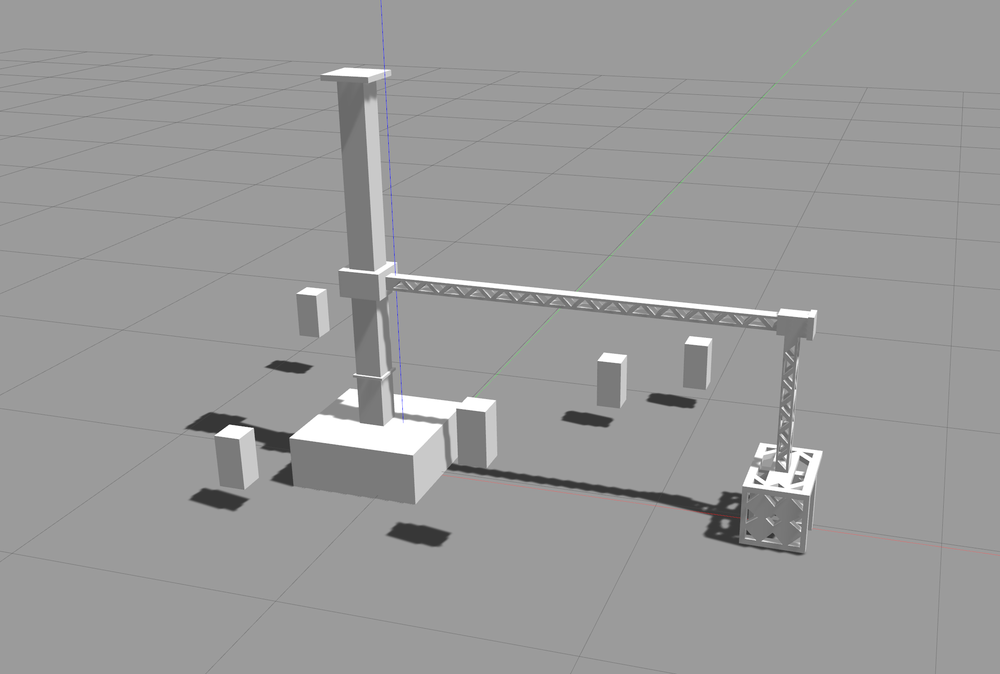
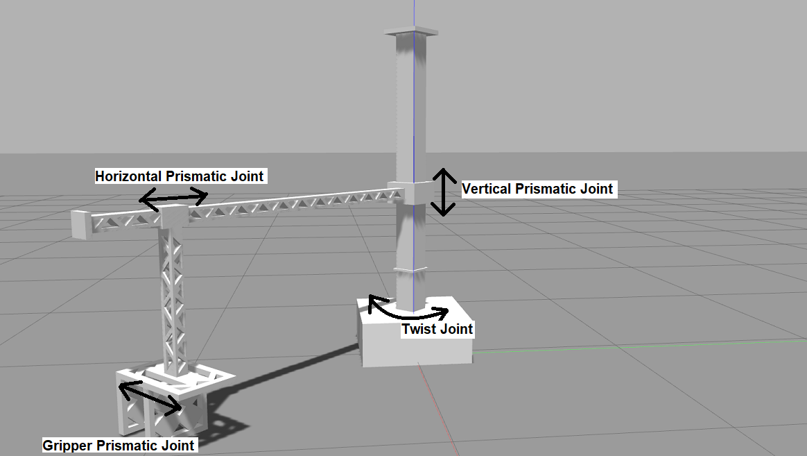
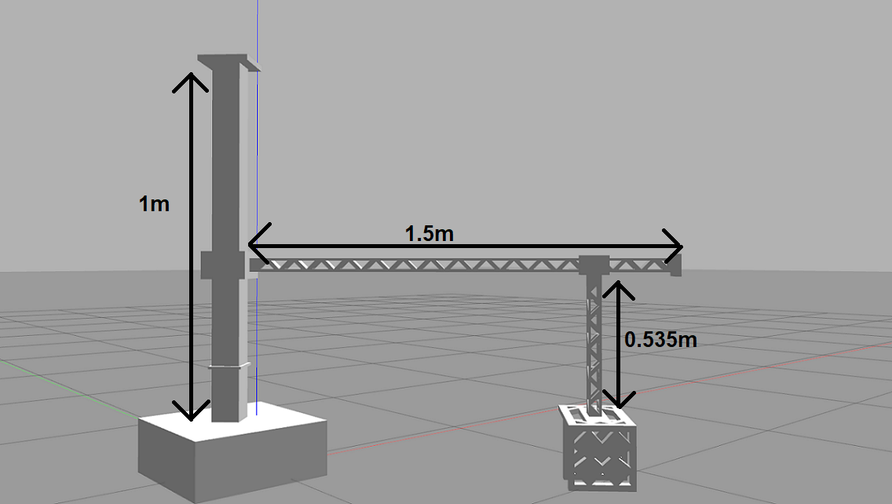
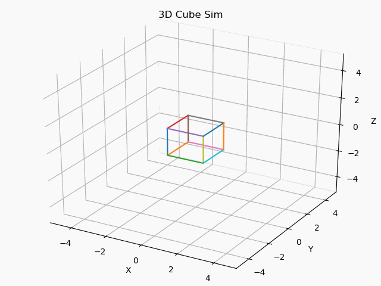

# Robotic Systems - UE19EC339
Repository that contains the starter codes for assignments and general instructions, links and resources.

## Project II
The `grip_and_sense` metapackage consists of two packages `janitor_description` and `robotic_arm_control` which provide
the arm itself and its functionality respectively. These packages also contain the necessary starter code and utility classes 
that provide controllers for each joint of the arm and a spawner for the boxes to be gripped.

The objective of this project is to understand and solve for the kinematics of a simple RPP (Revolute-Prismatic-Prismatic)
gripper in order to grip the spawned boxes and make contact with them. The function of the arm is just a gripper which is used in
pick and place tasks. The ends of the gripper are attached with contact sensors that senses when another object touches either end. The task is to solve for its inverse kinematics, move the gripper to the obtained pose and make contact with each
of the spawned boxes.

The robotic arm consists of four joints as seen in this figure. All joints except the gripper prismatic joint can be influenced
by your solution to the inverse kinematics and implementation of `iKine`.

The lengths of each link are as shown below. This information is needed to solve for the inverse kinematics of the arm.

The class `arm_control` is responsible for controlling the joints of the RPP arm. It subscribes to the state and
publishes the desired `theta`(the angle swept by the revolute/twist joint), `vert_pos`(the vertical displacement of the first prismatic joint measured from the base) and `hor_pos`(the horizontal displacement of the second prismatic joint measured from
the first prismatic joint).

`model_spawner` spawns rectangular boxes which float at fixed positions around the robotic arm.

### How to run
1. Clone this repo, copy `grip_and_sense` to the `src` of your workspace and `cd` into it.
1. Run `cp ./libcontact.so ../../devel/lib/`.
1. Change the permissions on the python scripts by running `chmod +x *.py` inside `robotic_arm_control/scripts`.
1. Install the dependencies mentioned [here](#dependencies) using `sudo apt install`.
1. Build your workspace by running `catkin_make` as usual. Don't forget to `source devel/setup.bash`! ***Please let the TAs know if the build fails due to a missing package!***
1. Spawn the RPP arm using `roslaunch janitor_description janitor.launch`.
1. In a new terminal, run the main task script using `rosrun robotic_arm_control main.py`. You should see
the rectangular boxes spawn and the arm moving to a fixed position.

### Implementation details in `inverse_kinematics.py`
1. Please use our implementation of the inverse tangent function, `myAtan2`. This is for compatibility with the model of
the robotic arm.
1. `point` is a 3x1 vector consisting of the desired x, y and z coordinates at which the gripper must make contact with the box.
1. Solve for the inverse kinematics of the RPP arm. Use those equations to find the values of the joint variables `theta`,
`vert_pos` and `hor_pos`.
1. Return the computed values of the joint variables in a list.

### Submission guidelines
1. Solve for the inverse kinematics on paper and attach a picture of the same inside `grip_and_sense`.
1. Complete the function `iKine` in `inverse_kinematics.py`.
1. Perform a run as indicated in 4, 5 and 6 [here](#how-to-run).
1. Run the following to copy the submission binary to `grip_and_sense` -> `cp ~/.ros/submit.bin <path_to_your_ws>/src/grip_and_sense`.
1. An automated script will grade based on the binary generated. This will be compared to the reference binary generated using our solution.
1. Submit a zip containing _only_ the modified metapackage `grip_and_sense`. The zip should bear your name, team ID and SRN (`FullName_TeamID_PES1UG19XXXXX`). It should contain `submit.bin` and an attached picture of your solution to the inverse kinematics problem. **Each group must make only one submission, preferably by a team leader.**

### Dependencies
- `ros-noetic-ros-control`
- `ros-noetic-ros-controllers`
- `ros-noetic-joint-state-controller`
- `ros-noetic-effort-controllers`
- `ros-noetic-position-controllers`
- `ros-noetic-velocity-controllers`
- `ros-noetic-gazebo-ros`
- `ros-noetic-gazebo-ros-control`

## Project I
The `cube_sim` package contains the necessary starter code and a utility class that implements a discrete integrator.

The objective of this project is to understand and develop a framework for simulating an object, in our case, a simple cube in 3
dimensions. Whenever a force or a torque is applied to an object, its motion and pose is described by
[Newton's laws](https://en.wikipedia.org/wiki/Newton%27s_laws_of_motion) and the extended 
[Euler's Laws](https://en.wikipedia.org/wiki/Euler%27s_laws_of_motion) of motion.

You may assume the cube to have a uniform mass distribution and that each force vector originates at its center of mass.
Modelling the state for an object such as a cube is straightforward and involves only the most basic form of motion laws.

### How to run
1. Clone this repo and `cd` into `cube_sim`. This is the Python package with all the necessary scripts.
1. To view the demo, run `3d_cube_anim.py` with Python3.
1. Once you have completed implementing `simulator.py` and uncommented the neccessary lines in `3d_cube_anim.py`,
run `3d_cube_anim.py` again.

### Implementation details in `simulator.py`
1. If you're going to use an integrator, initialize it accordingly in the constructor for `MySolver`.
1. The solver's state maintained at each iteration consists of the state vector and its first derivative,
the array of force vectors and an iteration number. The state vector is modelled as a 6x1 vector 
and  . Each force vector is modelled as .
1. Each successive call to `next_iter` should update the state. Don't return the state in this method, use `get_x` for that.
Here you should consider the force vector `self.forces[i]` as input to the system and obtain a response for it in terms of the
state defined above.
1. The getters should return the state and its derivative.
1. The static method `get_rot_mat(x, y)` is used to obtain the rotation matrix which maps X's pose to that of Y.
Complete this method in order to map the cube's final pose in the last iteration to that of a randomly generated observing camera.
1. **[BONUS]** See if you can vectorize your solution. Vectorization refers to performing mathematical operations on entire vector arrays
without the explicit use of iteration. Not only will this result in faster execution times but will also make your solution concise with
higher code density.

### Submission guidelines
- Complete the interfaces in `simulator.py` and modify `run` in `3d_cube_anim.py`.
- There are 5 test cases, each being random and reproducible based on the seed value. The entire state vector over
all iterations will be stored in `data`. This as well as the obtained rotation matrix `camRotMat` will be exported to a csv file
as a single flattened array.
- An automated script will run your code and grade based on the values in each csv thus generated. This will be compared to the
solution values for that seed (within a threshold of course).
- Submit a zip containing _only_ the modified package `cube_sim`. The zip should bear your name and SRN (`FullName_PES1UG19XXXXX`).

### Dependencies
- [NumPy](https://pypi.org/project/numpy/)
- [matplotlib](https://matplotlib.org/)

## Mini-assignment I
The package is contained in `action_tutorial`.

The objective of this assignment is to understand how [**actions**](https://design.ros2.org/articles/actions.html) work in ROS.

### Overview
As seen from the above illustration, the package serves to replicate the behavior of **actions** in ROS using the example of a simple
counter. There are 2 main services `GoalService` and `ResultService` alongside a single pub-sub on `/feedback_topic`. The client sends a 
`goal` request to the server containing the value to be counted to, assuming that the count starts from 0. To
this, the server responds back with an acknowledgement and begins the process of counting. A timer based callback is then setup on the server to increment the counter at intervals of 1 second.
To initiate feedback from the server, the client sends another `result` request to the server and waits for a response to the same (this is sent when the counter's final value is reached).
Once this service call is handled on the server, it begins to publish "feedback" on `/feedback_topic`, which is the current value of the
counter at that instant of time. The client having subscribed to this feedback topic, listens to it and logs the data on it.
Once the counter's end value is reached, the server responses to the `result` request sent earlier. Both client and server log the final
values of the counter and continue to spin.

### How to run
1. Clone this repo, copy the `action_tutorial` folder into your workspace/src and build using `catkin_make`. 
2. Add `source ~/<path_to_your_ws>/devel/setup.bash` to the end of your `~/.bashrc`.
3. Start `roscore` in a new terminal.
4. In a new terminal, run `rosrun action_tutorial counter_action_server.py`.
5. In another terminal, run `rosrun action_tutorial counter_action_client.py <counter_end_value>`.

### Functionality to be implemented
1. A starting value to the counter instead of 0 (default).
2. A rate (in Hz) to the timer based callback for incrementing.
3. **[BONUS]** The server should decline `GoalService` in cases where the start value exceeds the end of the counter at the time of making the request from the client's side.

### Guidelines
- Follow the TODOs mentioned inside [`counter_action_client.py`](action_tutorial/scripts/counter_action_client.py), [`counter_action_server.py`](action_tutorial/scripts/counter_action_server.py) and [`CounterGoal.srv`](action_tutorial/srv/CounterGoal.srv).
- Upon completing each task mentioned under a TODO, please delete the corresponding TODO comment.
- An automated script will grade your code depending on the functionality achieved so please test your code before submitting.
- Submit a zip of the modified package folder `action_tutorial`. The zip should bear your name and SRN (`Firstname_PES1UG19ECXXX`).

## Environment setup for group based projects

### Prerequisites
1. Ubuntu 18 or Ubuntu 20 (VM of the same alternatively if not possible to install)
   - 8GB (or above) pendrive for Ubuntu Live USB (for installing Ubuntu itself)
   - 16GB (or above) pendrive for Ubuntu
2. ROS Melodic (Ubuntu 18) or ROS Noetic (Ubuntu 20)
3. Gazebo 11

### Useful links
- [Tutorial](https://www.fosslinux.com/10212/how-to-install-a-complete-ubuntu-on-a-usb-flash-drive.htm) for installing Ubuntu 20 on pendrive
- [Tutorial](https://www.tecmint.com/install-ubuntu-alongside-with-windows-dual-boot/) for dual booting Ubuntu with Windows **(TAs are not responsible in case of any data loss or OS wipe)**. Please follow instructions carefully if you are going this route.
- Installation of [ROS Melodic](http://wiki.ros.org/melodic/Installation/Ubuntu) for Ubuntu 18
- Installation of [ROS Noetic](http://wiki.ros.org/noetic/Installation/Ubuntu) for Ubuntu 20
- Installation of [Gazebo](http://www.gazebosim.org/tutorials?tut=install_ubuntu) for Ubuntu 18/20

## Resources
- Official [ROS wiki](wiki.ros.org). Contains a conceptual overview as well as step by step tutorials to help
you get a feel for ROS and its capabilities.

