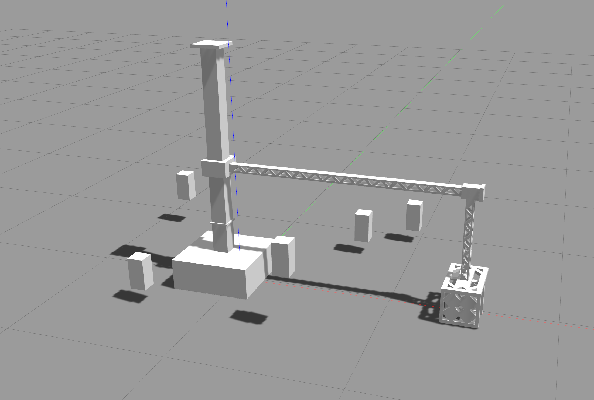
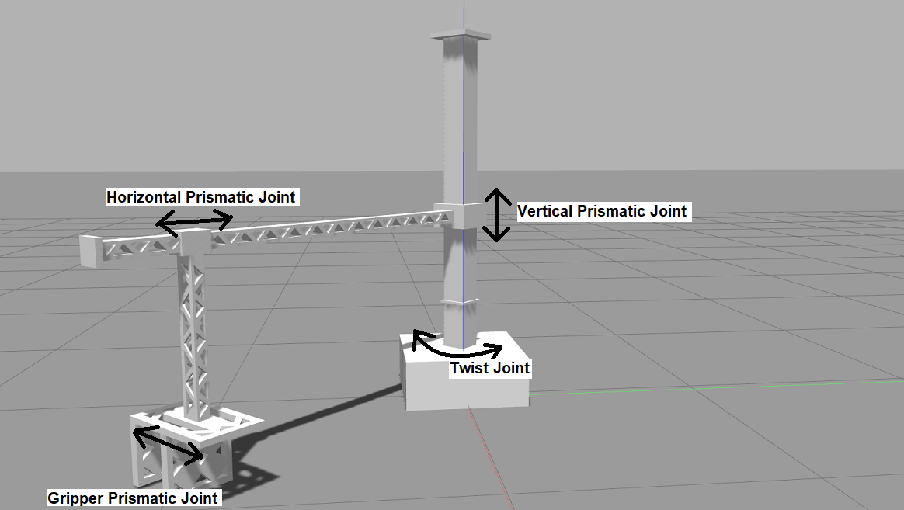
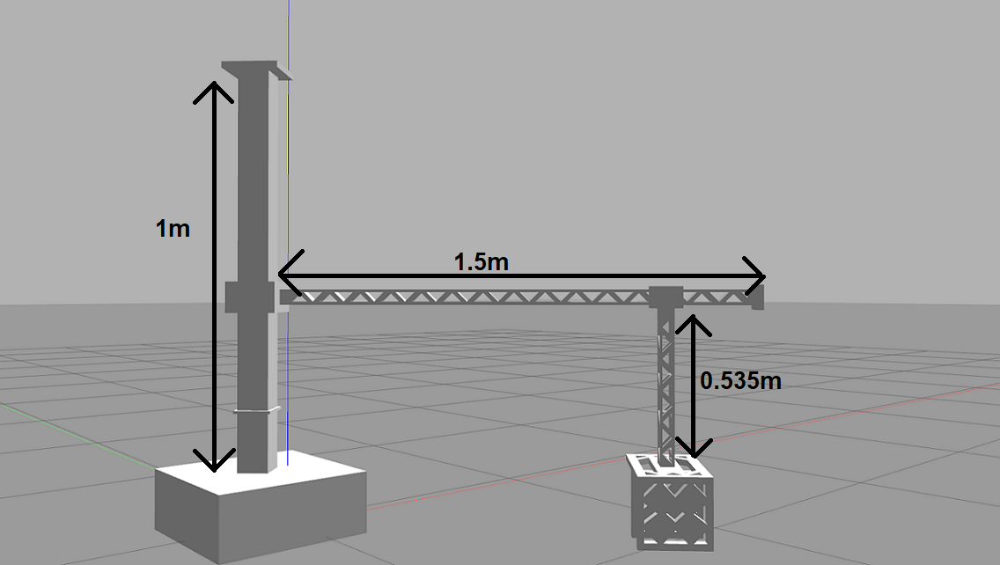

## Project II
The `grip_and_sense` metapackage consists of two packages `janitor_description` and `robotic_arm_control` which provide
the arm itself and its functionality respectively. These packages also contain the necessary starter code and utility classes 
that provide controllers for each joint of the arm and a spawner for the boxes to be gripped.

The objective of this project is to understand and solve for the kinematics of a simple RPP (Revolute-Prismatic-Prismatic)
gripper in order to grip the spawned boxes and make contact with them. The function of the arm is just a gripper which is used in
pick and place tasks. The ends of the gripper are attached with contact sensors that senses when another object touches either end. The task is to solve for its inverse kinematics, move the gripper to the obtained pose and make contact with each
of the spawned boxes.

The robotic arm consists of four joints as seen in this figure. All joints except the gripper prismatic joint can be influenced
by your solution to the inverse kinematics and implementation of `iKine`.

The lengths of each link are as shown below. This information is needed to solve for the inverse kinematics of the arm.

The class `arm_control` is responsible for controlling the joints of the RPP arm. It subscribes to the state and
publishes the desired `theta`(the angle swept by the revolute/twist joint), `vert_pos`(the vertical displacement of the first prismatic joint measured from the base) and `hor_pos`(the horizontal displacement of the second prismatic joint measured from
the first prismatic joint).

`model_spawner` spawns rectangular boxes which float at fixed positions around the robotic arm.

### How to run
1. Clone this repo, copy `grip_and_sense` to the `src` of your workspace and `cd` into it.
1. Run `cp ./libcontact.so ../../devel/lib/`.
1. Change the permissions on the python scripts by running `chmod +x *.py` inside `robotic_arm_control/scripts`.
1. Install the dependencies mentioned [here](#dependencies) using `sudo apt install`.
1. Build your workspace by running `catkin_make` as usual. Don't forget to `source devel/setup.bash`! ***Please let the TAs know if the build fails due to a missing package!***
1. Spawn the RPP arm using `roslaunch janitor_description janitor.launch`.
1. In a new terminal, run the main task script using `rosrun robotic_arm_control main.py`. You should see
the rectangular boxes spawn and the arm moving to a fixed position.

### Implementation details in `inverse_kinematics.py`
1. Please use our implementation of the inverse tangent function, `myAtan2`. This is for compatibility with the model of
the robotic arm.
1. `point` is a 3x1 vector consisting of the desired x, y and z coordinates at which the gripper must make contact with the box.
1. Solve for the inverse kinematics of the RPP arm. Use those equations to find the values of the joint variables `theta`,
`vert_pos` and `hor_pos`.
1. Return the computed values of the joint variables in a list.

### Submission guidelines
1. Solve for the inverse kinematics on paper and attach a picture of the same inside `grip_and_sense`.
1. Complete the function `iKine` in `inverse_kinematics.py`.
1. Perform a run as indicated in 4, 5 and 6 [here](#how-to-run).
1. Run the following to copy the submission binary to `grip_and_sense` -> `cp ~/.ros/submit.bin <path_to_your_ws>/src/grip_and_sense`.
1. An automated script will grade based on the binary generated. This will be compared to the reference binary generated using our solution.
1. Submit a zip containing _only_ the modified metapackage `grip_and_sense`. The zip should bear your name, team ID and SRN (`FullName_TeamID_PES1UG19XXXXX`). It should contain `submit.bin` and an attached picture of your solution to the inverse kinematics problem. **Each group must make only one submission, preferably by a team leader.**

### Dependencies
- `ros-noetic-ros-control`
- `ros-noetic-ros-controllers`
- `ros-noetic-joint-state-controller`
- `ros-noetic-effort-controllers`
- `ros-noetic-position-controllers`
- `ros-noetic-velocity-controllers`
- `ros-noetic-gazebo-ros`
- `ros-noetic-gazebo-ros-control`
